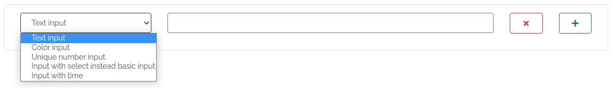
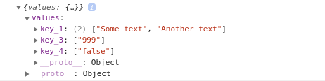
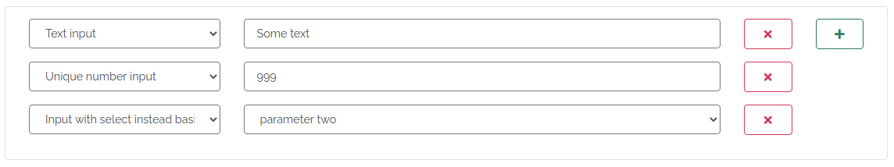

# jquery.searchParams
> searchParams is jquery plugin, provides: adding div with custom search parameters. [Watch live demo](https://codepen.io/dervDice/pen/OJbNMaj)

### Requirements
- jquery
- bootstrap.grid

### Methods
- [`init`](#init)
- [`rowsCount`](#rowscount)
- [`exportJSON`](#exportjson)
- [`exportJsonStr`](#exportjsonstr)
- [`importJSON`](#importjson)
- [`importJsonStr`](#importjsonstr)

----
### init
With `init` you can initialize and specify new div with `searchParams`

Example: 
```javascript 
$('#foo').searchParams('init', args)
```

Available `args`:
- `selectOptions` - list of rows specifications. 
  - `name <string>` - name of input
  - `type <const>` - must be one of constant: `text`, `color`, `number`, `date`
  - `tittle <string>` - this text will be shown in **select** div
  - `isSingle <bool>` -  makes this row unique and available only once
- `customRowType` - list of rows specifications where **select** instead **input**. Also, you can add **input** with custom types here.
  - `name <string>` - name of input/select value
  - `type <string>` - must be unique. this must start with 'select' to add **select** by value
  - `tittle <string>` - this text will be shown in **select** div
  - `params <array of {tittle, value}>` - only needed if value is **select** instead **input**
  - `code <string>` - html code of custom **input**. Example: `<input class="form-control" type="time">`
- `plusDirection <top | bottom>` - direction of `+` button  
- `plusBtnClass <string>` - custom css class for the `+` button
- `crossBtnClass <string>` - custom css class for the `+` button

Example:
```javascript
$('#foo').searchParams('init', {
  selectOptions: [ // Requirement
    {
      name: 'key_1',
      type: 'text',
      tittle: 'Text input'
    },
    {
      name: 'key_2',
      type: 'color',
      tittle: 'Color input'
    },
    {
      name: 'key_3',
      type: 'number',
      tittle: 'Unique number input',
      isSingle: true
    }
  ],
  customRowType: [ // Optpional.
    {
      name: 'key_4',
      type: 'select_1',
      tittle: 'Input with select instead basic input',
      isSingle: true,
      params: [
        {tittle: 'parameter one', value: 'true'},
        {tittle: 'parameter two', value: 'false'},
        {tittle: 'parameter three', value: 'null'},
      ]
    },
    {
      name: 'time',
      type: 't',
      tittle: 'Input with time',
      code: `<input class="form-control" type="time">`
    },
  ],
  plusDirection: 'top' // Optpional. 'bottom' by default
})
```

Returns:



### rowsCount
Returns current rows count

Example:
```javascript 
arert($('#foo').searchParams('rowsCount'))
```

### exportJSON
Exports current search parameters into JSON object

Example:
```javascript 
arert($('#foo').searchParams('exportJSON'))
```

Returns:



### exportJsonStr
Exports current search parameters into JSON string

Example:
```javascript 
arert($('#foo').searchParams('exportJsonStr'))
```

Returns:
```json
{"values":{"key_1":["Some text","Another text"],"key_3":["999"],"key_4":["false"]}}
```

### importJSON
Imports search parameters from JSON object and overrides current selected parameters

_Important: `selectOptions` list must contain all `type` before import !_

Example:
```javascript 
arert($('#foo').searchParams('importJSON', {"values":{"key_1":["Some text","Another text"],"key_3":["999"],"key_4":["false"]}}))
```

Returns:



### importJsonStr
Similar `importJSON`, but handles string instead Object

Example:
```javascript 
arert($('#foo').searchParams('importJSON', '{"values":{"key_1":["Some text","Another text"],"key_3":["999"],"key_4":["false"]}}'))
```
